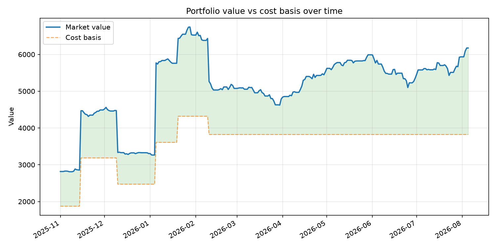
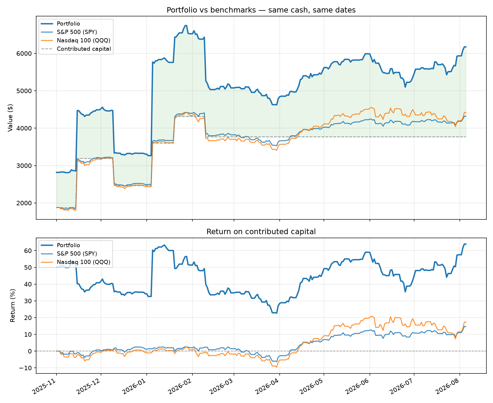

# Portfolio Analytics


A command-line tool that reconstructs a stock portfolio's full history from a
transaction log, values it against real market prices, and computes the
return and risk metrics a broker's app doesn't show you — like the gap
between how your *stock picks* performed versus how your actual *timing*
performed.

Built to answer a specific question I kept asking myself while trading:
"my broker says I'm up X%, but is that because I picked well, or because I
happened to deposit money right before a rally?" Nothing in a standard
broker app separates those two things. This does.



*(Chart generated from the included sample data — real personal trading
data is excluded from this repo; see [Privacy](#privacy--data) below.)*

## Benchmarking against the index

The tool answers the question most portfolio trackers dodge: **would I have
done better just buying the index?**

```
                      Final value    Contributed            P/L    Return    vs Portfolio
-----------------------------------------------------------------------------------------
Portfolio               $3,159.85      $2,800.00       $+359.85   +12.85%
S&P 500 (SPY)           $2,968.15      $2,800.00       $+168.15    +6.01%        $+191.70
Nasdaq 100 (QQQ)        $3,311.75      $2,800.00       $+511.75   +18.28%        $-151.90
```



The chart shows both views: absolute value (where the step-jumps are
deposits, not gains — hence the contributed-capital line) and return on
contributed capital, which strips out portfolio size so the three lines
are directly comparable.

## What it does

- **Reconstructs holdings day by day** from a raw transaction log (buys,
  sells, dividends, splits), using **FIFO lot matching** — the same
  convention most tax authorities default to, and one that makes "which
  purchase did this sale close out" an unambiguous question.
- **Values the portfolio** against real daily closing prices, pulled and
  cached locally via `yfinance`.
- **Computes two different return figures** and explains why they diverge:
  - **Time-weighted return (TWR)** — strips out the effect of *when* you
    added or removed money. Answers "how did my stock selection perform,"
    and is the number to use when comparing against a benchmark index.
  - **Money-weighted return (XIRR)** — the annualised rate that actually
    reconciles every cash flow you made. Answers "what did I actually
    earn, given when I put money in."
- **Risk metrics**, computed on a cash-flow-adjusted series so that
  depositing money is never mistaken for a market gain:
  volatility, Sharpe ratio, maximum drawdown (with duration), and rolling
  beta against a benchmark.
- **Per-position return attribution** — which holdings actually drove the
  overall return, separating "big position" from "good position."
- **Benchmark comparison against the S&P 500 and Nasdaq 100**, on
  *matched cash flows* — it simulates buying the index with exactly the
  same money on exactly the same dates, rather than quoting the index's
  headline return. See [Design decisions](#design-decisions) for why that
  distinction matters.
- **75 automated tests** (`pytest`, run on every push via GitHub Actions),
  including regression tests for two real bugs caught during development
  (see [Known limitations](#known-limitations)).

## Quick start

```bash
git clone https://github.com/Sid-OP-collab/portfolio-analytics.git
cd portfolio-analytics
python -m venv venv
venv\Scripts\activate        # Windows; use `source venv/bin/activate` on Mac/Linux
pip install -r requirements.txt

python src/valuation.py data/sample_transactions.csv   # portfolio value over time
python src/returns.py data/sample_transactions.csv      # TWR and XIRR
python src/risk.py data/sample_transactions.csv         # volatility, Sharpe, drawdown, attribution
python src/plot_portfolio.py data/sample_transactions.csv  # saves a chart to reports/
python src/benchmark.py data/sample_transactions.csv       # vs S&P 500 and Nasdaq 100
python src/plot_benchmark.py data/sample_transactions.csv  # benchmark comparison chart
```

Run the tests:

```bash
pytest tests/ -v
```

To use your own data, export your transaction history to the schema below
and point any script at it instead of `data/sample_transactions.csv`.

## Transaction schema

```
date,ticker,action,quantity,price,fees
2026-01-01,AAPL,BUY,10,178.50,1.00
2026-01-15,AAPL,DIV,0,0.85,0.00
2026-02-01,AAPL,SELL,4,182.00,1.00
```

| Column | Meaning |
|---|---|
| `action` | `BUY`, `SELL`, `DIV`, or `SPLIT` |
| `quantity` | Shares for `BUY`/`SELL`; the split ratio for `SPLIT` (e.g. `2` for 2-for-1); `0` for `DIV` |
| `price` | Per-share fill price for `BUY`/`SELL`; total cash received for `DIV`; unused for `SPLIT` |

A cleaning script (`src/clean_transactions.py`) converts a raw broker
export into this format — written for my own broker's CSV layout, but the
transform logic is a useful reference for adapting to a different one.

## Architecture

```
loader.py       Reads and validates a transaction CSV
    -> ledger.py    FIFO lot matching; daily holdings + realised P&L
        -> valuation.py   Joins holdings to prices -> daily portfolio value
            -> returns.py     TWR and XIRR
            -> risk.py        Volatility, Sharpe, drawdown, attribution
            -> benchmark.py   Cash-flow-matched comparison vs SPY / QQQ
            -> plot_portfolio.py    Portfolio value chart
            -> plot_benchmark.py    Portfolio vs benchmarks chart
prices.py       Fetches and caches daily closes via yfinance
```

Each module is a pure function of the one before it — `ledger.py` never
touches prices, `valuation.py` never touches transactions directly — which
is what makes the test suite possible: every stage can be tested with
hand-built data and a known correct answer, without needing real market
data or a network connection.

## Design decisions

**Why FIFO, not average cost.** When you sell part of a position, which
shares did you sell? FIFO (oldest lots first) is the convention most tax
authorities assume by default, and it makes "which specific purchase did
this sale close" an auditable question — average cost blends every lot
together and can't answer that. The two methods actually produce different
answers whenever you've bought the same stock at different prices, which
is the normal case, not an edge case.

**Why both TWR and XIRR.** They can diverge a lot, and the gap itself is
informative. On my own real trading history: **TWR of +28.4%** against an
**XIRR of +44.1%** over the same period. That ~16-point gap isn't a bug —
it means I was depositing more heavily right as positions were already
rising, so my money-weighted return benefited from timing that my
stock-picking (measured by TWR) doesn't get credit for. A single "return"
figure would have hidden that entirely.

**Why benchmarks are compared on matched cash flows, not headline returns.**
Saying "the S&P returned 12% and I returned 20%" is not a fair comparison
if the money arrived gradually. An index that rose 12% over the period did
not rise 12% on capital that only showed up last month — so quoting the
full-period figure overstates what an index investor with the same deposit
schedule would actually have earned. Instead, `benchmark.py` simulates
buying the index with each contribution on the day it was made, which makes
the two sides answer the same question. Two related choices: it uses ETFs
(SPY, QQQ) rather than raw index levels (^GSPC, ^NDX), because ETF prices
are what an investor could actually have bought and, adjusted, include
dividends — an index price level doesn't, which would quietly flatter the
portfolio; and dividends received are excluded from contributed capital,
since they're internally generated rather than new money the investor
added.

**Why risk metrics are computed on a cash-flow-adjusted series, not raw
value.** This was a real bug caught while testing against my own data:
volatility, Sharpe, and drawdown were originally computed directly on
`total_value`, which jumps every time money is deposited. The code read
each deposit as a huge one-day "gain." On my real history this inflated
annualised volatility from a genuine ~26% to a reported 74%, and
understated my worst drawdown (−51% reported vs. −22% actual) because a
deposit happening to land during a dip masked the loss. The fix builds a
synthetic "unit price" series — like a fund's NAV per share — that only
moves when markets move, and every risk metric is computed on that
instead. `tests/test_risk.py` has explicit regression tests pinning this
down so it can't silently regress.

## Known limitations

- **Dividends aren't modelled as a cash balance.** They're recorded in the
  transaction log but don't currently add to portfolio value anywhere,
  which means TWR, XIRR, and total value are all slightly understated
  relative to what a broker (which typically assumes dividends are
  reinvested or held as cash) would report. The next planned addition is
  a cash sub-ledger to close this gap.
- **Position attribution is a start/end-date approximation.** Each
  position's contribution to return is computed from its first and last
  held date, not a true daily-weighted calculation — the standard
  simplification for a summary table, but not exact if a position was
  added to gradually over a long period.
- **The benchmark simulation ignores trading costs and assumes fractional
  units.** Both are generous to the benchmark rather than to the portfolio,
  so the comparison isn't flattering itself — but a real index investor
  would face spreads and, historically, whole-share constraints.
- **No tax handling, no FX/multi-currency support**, and corporate actions
  beyond simple splits (e.g. spin-offs, mergers) aren't handled.
- **XIRR can be undefined for very short holding periods** (a few days) —
  annualising a tiny window has no stable solution, so the function
  returns `None` in that case rather than an arbitrarily large number.

## Privacy & data

This repo ships with `data/sample_transactions.csv`, a synthetic file
covering the same edge cases as real trading data (fractional shares, a
dividend, a same-ticker buy/sell) without exposing anyone's actual
holdings. My real transaction history and the price cache it generates
are excluded via `.gitignore` and never leave my machine.

## Tech

Python, pandas, yfinance, matplotlib, scipy (for XIRR's root-finding),
pytest, GitHub Actions.
